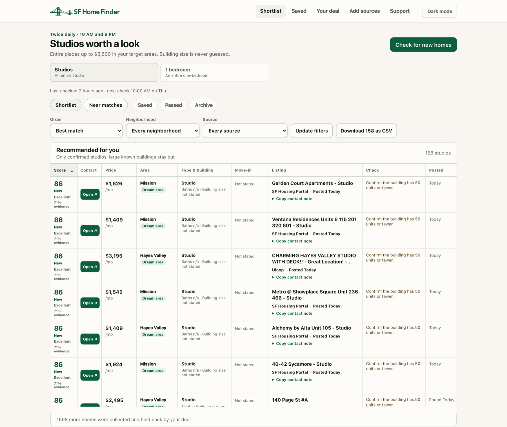
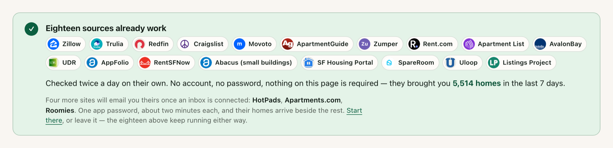
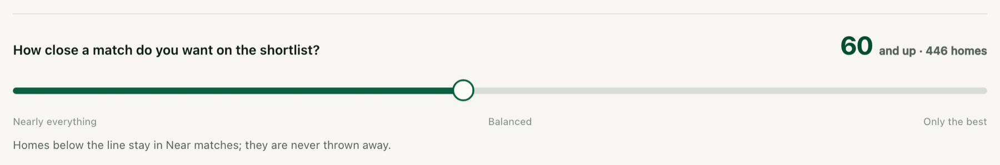

# SF Home Finder

Finding a place in San Francisco is miserable right now. Rent is about as high as it has ever
been, the tech money is back, and anything decent is gone before you have finished reading it.
You end up with fourteen tabs open, checking the same sites at midnight, and still missing
things.

I built this for my own search. Figured other people might get some use out of it, so here it
is. It is free, it runs on your own laptop, and it takes about three minutes to start.

<picture>
  <source media="(prefers-color-scheme: dark)" srcset="docs/screenshots/shortlist-dark.png">
  
</picture>

## Install it

Open **Terminal** — press `Cmd` + `Space`, type `Terminal`, press Return — then paste this and
press Return:

```
curl -fsSL https://github.com/2millerhenry/sf-housing-monitor/raw/HEAD/install.sh | bash
```

<sub>*19 MB download · about 2–3 minutes · roughly 155 MB on disk when it is done · no password,
no admin*</sub>

**Works on** a Mac with Apple Silicon — an M1 or newer — on macOS 15.6 or later. Not Intel
Macs, and not Windows yet.

Most of that time is one download: the app brings its own copy of Python rather than touching
the one your Mac came with, so nothing else on your machine changes. If the window looks like
it is sitting still, it is working. Your browser opens by itself when it is done.

<details>
<summary><b>Rather click than paste?</b> Use the ZIP instead.</summary>

<br>

1. **[Download the ZIP](https://github.com/2millerhenry/sf-housing-monitor/releases/latest)**
   and double-click to unpack it.
2. Open the folder. **Control-click** `2 Install SF Home Finder.command`, choose **Open**, then
   **Open** again.
3. Wait a few minutes. Your browser opens on its own.

Control-click rather than double-click, because macOS blocks unsigned apps opened the normal
way. [Why that is safe to click through](#why-does-my-mac-warn-me). The command above does not
show that warning, because macOS only marks what a *browser* downloaded — the file is identical
either way.

</details>

### Opening it later

Type `homefinder` in a terminal, or open **http://127.0.0.1:8000** and bookmark it. It runs on
its own, so there is never anything to start.

<sub>`homefinder help` has the rest — status, logs, repair — if you ever need them.</sub>

## What it does for you

**It finds far more than you would on your own.** Eighteen rental sites are already connected
the moment you install it — the big ones everybody knows, plus the small local boards where the
cheap rooms and the rent-controlled places actually turn up. No sign-ups, no keys, nothing to
switch on. That is thousands of listings a week, read so you do not have to.

**Want more? Adding a source takes about two minutes.** Connect an inbox and HotPads,
Apartments.com and Roomies start contributing too. There is a Facebook Marketplace connector
and a Furnished Finder one alongside them. Each is a couple of fields and a save — and every
one of them is optional, and off until you ask.

**Then it does the boring part.** Every home is scored against what *you* said you wanted and
sorted best-first, so what you open is a shortlist with reasons attached rather than a
firehose. Star the good ones, pass on the rest, leave yourself notes, filter by neighborhood or
source or move-in date.

**You set the rules.** A room in a shared house, a whole studio or one-bed, or a two- or
three-bed to split with friends — each with its own budget, its own areas, its own answers.
Change your mind next month and everything it has ever collected is scored again against the
new answer.

**Free, private, and quiet.** No account, no server, no subscription, ever. It collects nothing
about you — no analytics, no logs sent anywhere, no email address, not even a sign-up — and
your search never leaves your laptop. It never acts in your name either: no automated emails to
landlords, no forms filled in, no applications. It reads what is already public and hands it to
you.

## Once it is running

**Tell it what you want.** The page that opens asks your budget, the neighborhoods you would
live in, whether you want a whole place or a room in a shared house, how long a lease, when you
need to be in. Five minutes, and you never do it again. Press save and it goes looking straight
away — the first search usually brings back a few hundred homes.

**Then leave it alone.** It looks again at ten in the morning and six in the evening, every
day, as long as your Mac is awake and logged in. Nothing to remember, nothing to keep open.

**Check in whenever it suits you.** Best matches at the top, with the reason each one scored
that way. Star the ones worth a message, pass on the rest — what you have dealt with does not
come back.

## A closer look

**Eighteen sites, no accounts, nothing to set up.**



HotPads, Apartments.com and Roomies only ever send listings by email, so those three need one
inbox connected — optional, and the eighteen keep running either way.
[What is read from each site](docs/sources.md).

**Being fussy has a price, and you can see it.**



Tighten your budget or drop a neighborhood and the count moves as you type. Homes below the
line are not lost — they wait in **Near matches**, and widening your search later does not mean
starting from an empty page. [How scoring works](docs/how-it-works.md).

## Questions

### Is it really free?

Yes — free to install, free to run, free forever, and there is no paid version to graduate to.
It runs on your own machine, so there is no server for anyone to pay for. If it finds you
somewhere to live there is one optional donation line in the footer, and that is the whole of
the ask.

### Where does my information go?

Nowhere. Your answers, the listings, your notes and any password you add are written to one
folder on your Mac and never leave it. There is no account and no analytics. Uninstalling keeps
your data unless you explicitly type `DELETE` when it asks.

### Why does my Mac warn me?

Only the ZIP does — the one-line command does not.

Apple charges 99 dollars a year to sign an app so that macOS opens it without complaint. This
project does not pay it, so you get *"cannot be opened because it is from an unidentified
developer"* the first time. It is a statement about a receipt, not about the app.

Control-click → **Open** → **Open** is Apple's own way through it, and it is how most free Mac
software gets installed. You only do it once; the installer clears the flag for everything else
in the folder.

**Do not turn Gatekeeper off system-wide to avoid this.** It protects everything else on your
machine. If you would rather not trust a download at all, the whole source is here and you can
[build it yourself](docs/development.md).

### Do I have to connect my email?

No. The eighteen main sites need nothing. Connecting an inbox only adds HotPads,
Apartments.com and Roomies, and it uses a read-only app password — a separate one-purpose
password, never your real one — that stays on your machine. Messages are opened without being
marked read, only known housing senders are searched, and no message is ever stored.

### Does it run when my laptop is shut?

No. It needs the Mac awake and logged in. If it misses a check because you were asleep or away,
it catches up when you come back.

### Can I check right now instead of waiting?

Yes — there is a **Check for new homes** button, once a day. It is limited to once because
these are other people's websites, and hammering them is how you get blocked from a source
entirely.

### Something looks broken. What do I do?

Double-click **Verify SF Home Finder.command**. It runs a check over the whole app and
names one specific thing to do for each problem it finds. **Repair** fixes most of them without
touching your deal, your saved homes or your notes.

### Is pasting a command from the internet safe?

It is worth being suspicious of, so here is what that one does. It reads the
[release list](https://github.com/2millerhenry/sf-housing-monitor/releases), downloads the same
ZIP the button gives you, checks every file inside it against a checksum, and runs the
installer. It never asks for your password, because nothing here needs an administrator.
It is [forty lines long and you can read it first](install.sh) — or skip it entirely and use
the ZIP.

### What if I am not looking in San Francisco?

Then this will not help you much as it stands — the sources, neighborhoods and the city
housing portal are all SF-specific. It is MIT licensed, so you are welcome to fork it.

## For developers

- [Running from source, and the test suite](docs/development.md)
- [Where the listings come from](docs/sources.md)
- [How scoring works, and what it promises when a source breaks](docs/how-it-works.md)

## Worth knowing

This reads sites like Craigslist and Zillow on your behalf, the same pages you could open
yourself. Some of those sites have rules about automated reading, and they change them when
they like. Where you point it, and whether that is alright with the site, is your call.

It comes with no warranty. If it misses the apartment you would have loved, that is bad
luck rather than something anyone owes you for — see [LICENSE](LICENSE).

## Say thanks

This is free and it stays free — no account, no server, no subscription, and nothing held back
for a paid version, because there isn't one. I wrote it because I needed it, and it is more use
to other people than it is sitting on my laptop.

What it costs is upkeep. These sites redesign their pages without telling anyone, and when one
does, that source goes quiet until somebody fixes it — which is me, in the evenings.

**If it helped you find somewhere, or just saved you a few weeks of refreshing:
[buy me a coffee](https://ko-fi.com/millerhenry).**

Entirely optional, and genuinely so. Nothing is locked, nothing nags you, and nothing gets
worse if you skip it.

## License

[MIT](LICENSE).
